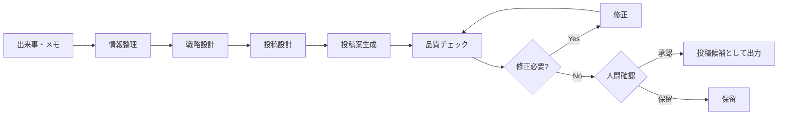

# AI × SNS/X運用支援・自動化 PoC

X運用を「投稿文を作るだけ」で終わらせず、
**情報収集 → 戦略設計 → 投稿設計 → 生成 → 品質チェック → 修正 → 人間確認 → 出力**
まで一連で処理する、小さなSNS運用PoCです。

このリポジトリは実運用中のシステム本体ではなく、
AIを使ったSNS運用フローの考え方を安全に公開するためのサンプルです。

外部AI APIは使用せず、Python標準ライブラリだけで動作します。

---

## 想定している課題

生成AIで投稿文を作れても、

- 投稿テーマが毎回バラバラ
- 実体験が薄くAIっぽい文章になる
- 投稿目的が曖昧
- 修正が反映されたか分からない
- 投稿前の確認作業が増える
- 同じ内容を何度も出してしまう
- 投稿後の改善につながらない

という問題が起こりやすくなります。

このPoCでは、
「投稿文生成」ではなく **SNS運用そのものを業務フロー化する**
ことを目的にしています。

---

## 運用フロー



---

## サンプル入力

`sample_input.json`

```json
{
  "date": "2026-09-22",
  "experience": "Discord Botの定時通知が二重送信される問題を調査した",
  "failure": "最初は通知処理だけを疑ったが原因が別の起動経路だった",
  "discovery": "自動化では処理本体だけでなく起動経路の重複確認も重要",
  "target": "中小企業の経営者",
  "goal": "プロフィール訪問",
  "external_publish": true
}
```

---

## サンプル出力

```json
{
  "theme": "自動化の失敗から分かったこと",
  "goal": "プロフィール訪問",
  "post_structure": [
    "意外な結論",
    "実際に起きた出来事",
    "原因",
    "学び",
    "読者への示唆"
  ],
  "quality_checks": {
    "has_real_experience": true,
    "has_specific_fact": true,
    "too_generic": false
  },
  "human_review_required": true,
  "status": "waiting_human_review"
}
```

---

## 実行方法

```bash
python -m src.main sample_input.json
```

出力:
```text
output/result.json
output/run.log
```

---

## テスト

```bash
python -m unittest discover tests
```

---

## PoCで自動化した範囲

- 実体験メモの整理
- 投稿テーマ選定
- 投稿目的の保持
- 投稿構成設計
- 品質チェック
- 修正要否判定
- 人間確認フラグ
- JSON出力
- 実行ログ保存

---

## 人間確認を残す理由

SNS投稿は会社や個人の信用に直接関わるため、
このPoCでは外部公開前に必ず人間確認を残しています。

AIに任せるのは、

- 情報整理
- 構成作成
- 品質チェック
- 改善候補の提示

までです。

最終的な公開判断は人間が行います。

---

## 本実装する場合の拡張例

- ChatGPT / Claude API
- Discord通知
- X投稿候補の自動生成
- 投稿 / 修正 / 保留ボタン
- 過去投稿との重複チェック
- 日次メモ連携
- 投稿結果の分析
- 翌日の改善への反映
- API利用量管理
- 投稿履歴保存

---

## 設計上のポイント

1. 投稿生成ではなく運用全体を見る
2. 実体験・失敗・具体的事実を優先する
3. AIらしい一般論を減らす
4. 修正内容が反映されたか確認する
5. 外部公開前に人間確認を残す
6. API費用・通知量・運用負荷を増やしすぎない

---

## License

MIT
